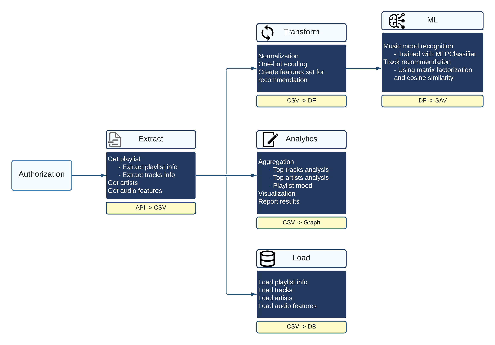

# Resonance - A tiny recommendation system


**Update** (15 December 2022): View the web application here at [Resonance](https://resonance.streamlit.app/)

## About the project

**Resonance** is a Content-based Recommendation System which suggests songs given user playlists. It has approximately *60,000* songs in its database, extracted and transformed using the **Spotify Million Playlist Dataset**.

### Spotify Million Playlist Dataset

A dataset of 1 million playlists consisting of over 2 million unique tracks by nearly 300,000 artists. For simplicity, I will just extract the first 1000 playlists which contain approximately 60,000 tracks.

## Pipeline


## Requirements

There are some general library requirements for the project and some which are specific to individual methods. The general requirements are as follows.

- `spotipy`
- `regex`
- `plotly`
- `sklearn`
  
Install requirements

```sh
pip3 install -r requirements.txt
```

**Note**: It is recommended to use ***Heroku*** for deploying the application.

## Usage

We will run the whole `model` package .

```shell
python -m model  
```

## Development

### Datasets
- `songs.csv`: songs extracted using playlists from **Spotify 1 Million Dataset**
- `features.csv`: normalized features only for recomendation system

### Scripts
- `normalize.py`: Transform json into csv using `json_normalise()`
- `scrap.py`: Extract song features from **Spotify API** 

### Modules
- `extract.py`: Extract playlist data and song features
- `preprocess.py`: Transform audio features, generate additional fields  and normalize numerical data
- `recommend.py`: Perform recommendation

## Extraction

### Authentication

We need to create the `ClientID` and `SecretID` so that we can use to send our request to Spotify API. Remember to place them securedly in a `.env` file .

We also need an URI to perform any function with the API referring to an object in Spotify. The URI of any Spotify object is contained in its shareable link.

```python
playlist_link = "https://open.spotify.com/playlist/37i9dQZEVXbNG2KDcFcKOF?si=1333723a6eff4b7f"
```
**Note**: When working directly with Spotify API, the song URI has the format `spotify:track:[id]`

### Scrapping

*The process including*:

- Extract URI from share link
- Use Spotify API to request song features from playlist using playlist URI
- Read json files and select song features

## Transformation

### Genre preprocess

Due to the import format of a dataframe, we need to convert the `genres` columns into a list. This is done by using the `split()` function.

### TF-IDF encoding

TF-IDF, also known as Term Frequency-Inverse Document Frequency, is a tool to quantify words in a set of documents. The goal of TF-IDF is to show the importance of a word in the documents and the corpus. The general formula for calculating TF-IDF is:

$$ \text{Term Frequency}\times\text{Inverse Document Frequency}$$

- **Term Frequency (TF)**: The number of times a term appears in each document divided by the total word count in the document.
- **Inverse Document Frequency (IDF)**: The log value of the document frequency. Document frequency is the total number of documents where one term is present.

The motivation is to find words that are not only important in each document but also accounting for the entire corpus. The log value was taken to decrease the impact of a large N, which would lead a very large IDF compared to TF. TF is focused on importance of a word in a document, while IDF is focused on the importance of a word across documents.

In this project, the documents are analogous to songs. Therefore, we are calculating the most prominent genre in each song and their prevelent across songs to determine the weight of the genre. This is much better than simply one-hot encoding since there is no weights to determine how important and widespread each genre is, leading to overweighting on uncommon genres.
### Normalization

Lastly, we need to normalize some variables. As shown below, the popularity variables are not normalized to 0 to 1, which would be problematic in the consine similarity function later on. In addition, the audio features are also not normalized. 

To solve this problem, we used the `MinMaxScaler()` function from `scikit learn` which automatically scales all values from the min and max into a range of 0 to 1.

## Recommendation model

### 1. Generate playlist vector and repository

#### Generate playlist vector
  - Input: playlist (preprocessed)
  - Method: create playlist vector by calculate the sum of each feature 
  - Output: vector summarize playlist features
#### Recommend repository
  - We create a repository of songs which are not in the playlist, these will be our suggest candidates
  - Method: select songs from `features.csv` which are not in user playlist using song ids

### 2. Generate recommendation

Find similarity between `playlist` and `repository` using cosine similarity. Extract top songs with highest similarity.
<!--eof>