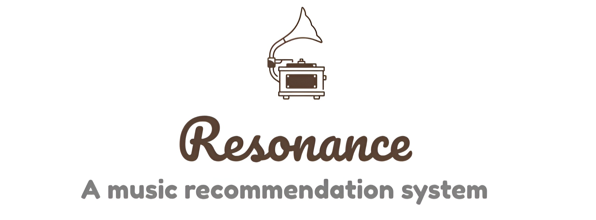

  

  

  

In the contemporary era of digital music consumption, music enthusiasts have unparalleled access to a vast ocean of musical content. However, within these expansive collections, the need to discover the ideal tunes can be simultaneously delightful and difficult. 

Our project since then was initiated from a keen aspiration to directly address this challenge by contructing an innovative and efficient music recommendation system which leverages both existing data provided by music streaming platform and contemporary technology of recommender engine and large language models.

## Table of Contents
- [System design](#system-design)
- [Recommendation engine](#recommendation-engine)
- [Data management](#data-management)
  - [Extraction](#1-extraction)
  - [Storage](#2-storage)
  - [Transformation](#3-transformation)
- [Web server](#web-server)
- [User interface](#user-interface)

## System design
The repository structure follows the conceptual architecture of resonance, which consists of four loosely-coupled sub-systems:
- [**Recommendation engine**](#recommendation-engine) analyzes users music preferences to provide personalized insights while also suggesting artists and songs that aligns with their music characteristics.
- [**Database**](#data-management) serves as a system for persistent storage of music data.
- [**Web server**](#web-server) exposes insights and recommendation on user music taste from recommendation engine via a RESTful API to the user interface.
- [**User interface**](#user-interface) displays results from recommendation engine while creating engaging and interactive user experiences.

Technologies used include **Python** & **Langchain** (recommendation engine), **FastAPI** (web server) and **PostgreSQL**. The frontend is designed and written in **React**. All backend components are containerized with **Docker**.

The recommendation engine employs **Content-based Filtering** method with **K-Nearest Neighbor** (KNN) algorithm, utilizing the [Spotify Million Playlist Dataset](https://www.aicrowd.com/challenges/spotify-million-playlist-dataset-challenge) for analyzing user music preferences. We've also integrated **OpenAI**'s advanced LLM model, fine-tuned specifically for music-related content.

## Recommendation engine
The recommendation engine comprises two essential components: Music Taste Analyzer and Song Recommender.

### 1. Music Taste Analyzer
In addition to providing song recommendations tailored to the user preferences, we have implemented a text-based system that offers a comprehensive analysis of individualized music characteristics, drawing insights from the user's specific music taste. 

The primary objective of the Music Taste Analyzer engine is to evaluate user musical preferences based on their specified criteria. This assessment yields a comprehensive explanation of the user’s music tastes, accompanied by a thoughtfully curated selection of musical artists that align with these preferences. 

### 2. Song Recommender
The Music Recommender employs content-based filtering technique, leveraging K-Nearest Neighbor (KNN) algorithm to suggest songs that are closely aligned with user music preferences.

[Content-based Filtering](https://developers.google.com/machine-learning/recommendation/content-based/basics) is a recommendation technique that uses unique features of items to find similar ones. It assigns a similarity score based on these features to generate recommendations. In the case of Spotify playlists, this involves analyzing song characteristics to compute an aggregate score for a playlist. Then, it recommends top similar songs that closely align with this score but are not already in the playlist.

The [K-Nearest Neighbor (KNN)](https://en.wikipedia.org/wiki/K-nearest_neighbors_algorithm) algorithm is commonly used in Content-based Filtering for music recommendation systems. It works by finding a specified number (K) of music tracks that closely match a user's current preferences. This is done by comparing features like genre, tempo, instrumentation, and user behavior patterns. By utilizing this similarity metric, KNN can make accurate predictions about which songs a user is likely to enjoy based on their past interactions with the platform.

### 3. Data Pipeline
A specialized data pipeline has been crafted to serve this objective, structured around two distinct use cases. In the scenario where users opt to furnish their own Spotify playlists as input, the pipeline initiates with the retrieval of diverse Spotify URIs within the user playlist, accompanied by their corresponding audio features and metadata. 

Following this, the system engages in a filtering process to remove URIs that are already present within the database. Subsequently, user playlist undergoes transformation into a unified vector of quantitative values, achieved through the application of mean summarization.

The resultant vector obtained here acts as a test point for **KNN** algorithm. This allows us to calculate distances between the playlist vector and other songs in the dataset. The top neighbors are then chosen and ranked in ascending order. It's important to highlight that the data point closest to the input features receives the highest rank. If users provide specific audio features, the system will exclusively use these attributes for generating recommendations using the KNN algorithm.

## Data management

### 1. Extraction
Our project revolves around refining the Spotify Million Playlist Dataset. We achieve this by meticulously cleaning the data, resulting in approximately 600,000 unique track identifiers (URIs). These URIs form the bedrock for interfacing with the Spotify API, allowing us to retrieve both audio characteristics and associated metadata for each track. This, in turn, enables us to develop a recommendation system finely tuned to individual user preferences.

Rather than utilizing the complete original dataset for training our recommendation engine, we've chosen a different approach due to limitations and inconsistencies in the JSON format. Instead, we've crafted a comprehensive solution that revolves around creating a customized dataset, with the Million Playlist Dataset at its core. This process involves the initial extraction of all song URLs, followed by a meticulous data aggregation and cleaning process. The goal here is to isolate unique URIs while eliminating any duplications.

Through this meticulous approach, we gather essential audio features and pertinent song metadata, which includes artist and album details. This carefully curated dataset will serve as the cornerstone of our recommendation engine, ensuring that users receive highly relevant results through our interface. 

Additional details about the data can be accessed via the [Spotify Developer](https://developer.spotify.com/documentation/web-api) platform. The code for the extraction process can be found in the associated [repository](https://github.com/nauqh/resonance/blob/main/backend/src/utils/utils.py).

### 2. Storage 
Following the extraction process, the acquired data will be subsequently loaded into a centralized database for further processing, which includes transformation into a machine-readable format. As outlined in the preceding section, the data obtained from the Spotify API comprises three primary categories:
- **Artist data** encompasses comprehensive information pertaining to the performing artist, including but not limited to genres, popularity, images, and external urls.
- **Song metadata** contains a diverse set of attributes related to the song, encompassing details such as genres, album information, release date, and popularity.
- **Audio features** encapsulates audio-related metrics for a given song, encompassing factors such as valence, danceability, mode, loudness, and instrumentalness.

### 3. Transformation
A critical aspect of preprocessing techniques employed in this procedure centers on two fundamental tasks: the normalization of numeric data and the computation of term frequencies for categorical data.

#### Data normalization
In the context of recommendation systems, data normalization plays a crucial role in ensuring that relevant variables are consistently scaled, thereby facilitating precise computations. Specifically, in the case of numeric audio features data, normalization is imperative to establish a uniform basis for comparisons and to prevent potential distortions in recommendation outcomes. To this end, we have harnessed the capabilities of the **MinMaxScaler()** function from the scikit-learn library, a highly potent tool adept at automatically standardizing values within a defined range of 0 to 1. 

#### Categorical data encoding
TF-IDF, also known as [Term Frequency-Inverse Document Frequency](https://en.wikipedia.org/wiki/Tf%E2%80%93idf), is a tool to quantify words in a set of documents. The goal of TF-IDF is to show the importance of a word in the documents and the corpus. The general formula for calculating TF-IDF score is:

The motivation is to find words that are not only important in each document but also accounting for the entire corpus. The log value was taken to decrease the impact of a large N, which would lead to a very large IDF compared to TF. Term Frequency (TF) focuses on how crucial a word is within one document, while Inverse Document Frequency (IDF) looks at how important a word is across all the documents.

## Web server
The web server is written in **Python** using **FastAPI**. It employs **Pydantic** to validate the integrity and quality of extracted Spotify data through customizable data quality checks and adherence to expected schema and format.  

The server provides access to recommendation engine results through a RESTful API, accessible at the endpoints **/analysis**, **/songs**, and **/artists**. Additionally, it serves the frontend application to facilitate user interaction with the system.

## User interface
The frontend architecture is developed using **Typescript** with **React** framework. Initially, users are presented with a variety of audio feature scales and options to customize their music preferences. Subsequently, upon user action, relevant user data is transmitted to the recommendation engine and the returned results are displayed on user interface.

Users have the option to personalize their music preferences, explore predefined music characteristics offered by the engine, or even integrate their Spotify playlists for enhanced music recommendations. Visit the user interface through this github [repository](https://github.com/nauqh/resonance/tree/master/frontend).