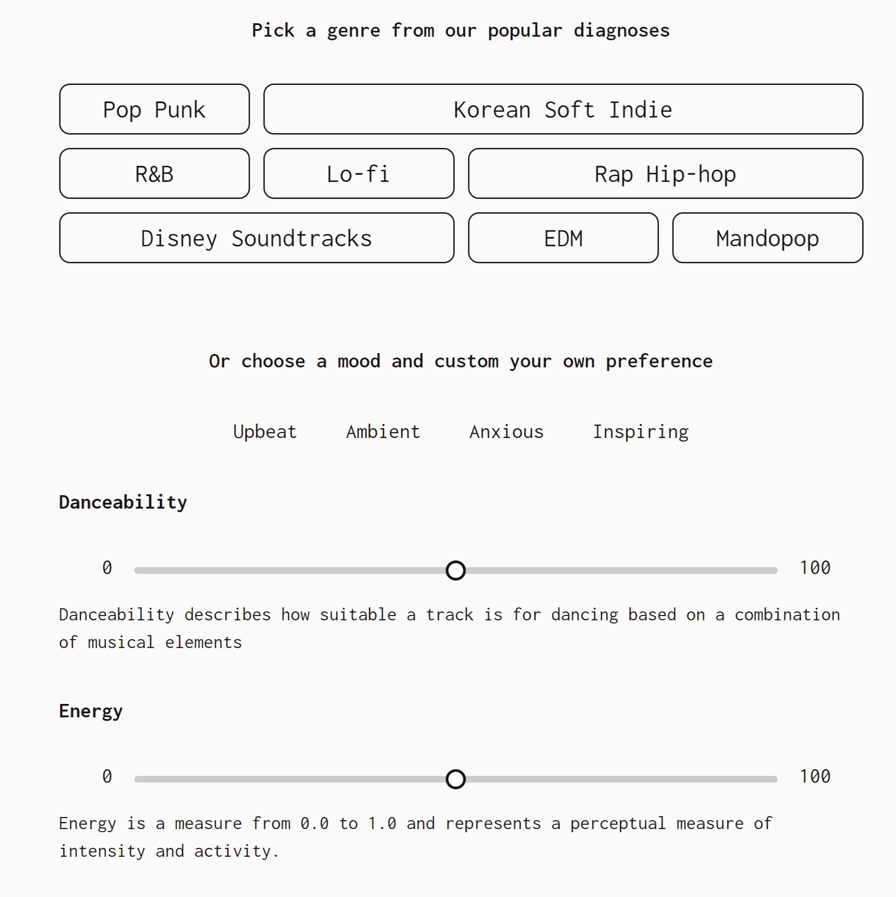
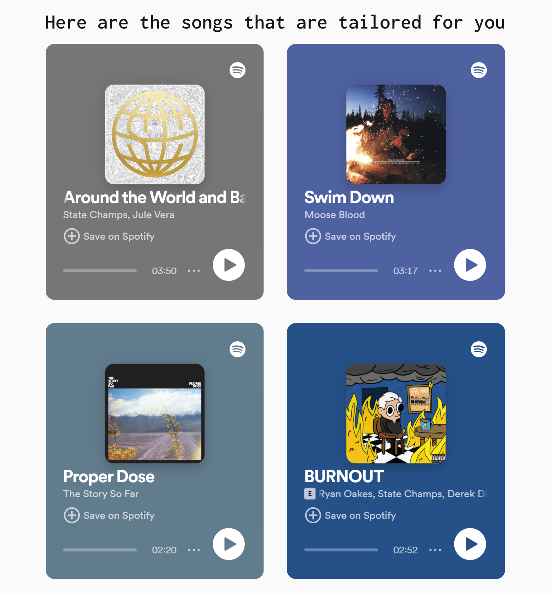

# Musicotherapy - A clinic for awful music taste

## Landing page
The frontend architecture is developed using **Typescript** with **React** framework. Users have the option to personalize their music preferences, explore predefined music characteristics offered by the engine, or even integrate their Spotify playlists for enhanced music recommendations. 

## Input page
Initially, users are presented with a variety of audio feature scales and options to customize their music preferences. Subsequently, upon user action, relevant user data is transmitted to the recommendation engine and the returned results are displayed on user interface.

  
  

## Result page

An in-depth analysis of use music taste is displayed together with recommendation of artists that well-presented the music characteristics.

  
  

The engine also generates tracks recommendation together with a Spotify playlist tailor for user music preferences.

  
  

